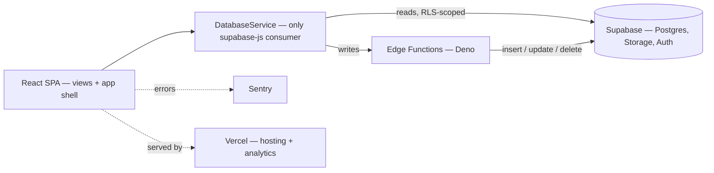

<p align="center">
  
</p>

<h1 align="center">Smyrna Tools</h1>

<p align="center">
  <b>The internal operations platform for Smyrna Ready Mix.</b>
</p>
<p align="center">
  Fleet, people, and plant performance in one place —<br />
  tracked across every region and plant at <a href="https://smyrnatools.com">smyrnatools.com</a>.
</p>

<p align="center">
  
  
  
  
  
  
  
  
</p>

<br />

## Why Smyrna Tools

Running a ready-mix concrete operation means keeping track of hundreds of moving assets, an operator workforce that flows through onboarding, training, and duty changes, and plant efficiency numbers that only matter once they roll up across regions. Smyrna Tools puts all of it behind one authenticated portal: every mixer and manager has a verified record and a full change history, and every write goes through the server — the browser never mutates the database directly.

<table width="100%">
  <tr>
    <td width="33%" valign="top">
      <h3 align="center">Fleet &amp; assets</h3>
      <p align="center">Mixers, tractors, trailers, equipment, and pickup trucks — each with verification status, service tracking, and a full change-history timeline.</p>
    </td>
    <td width="33%" valign="top">
      <h3 align="center">People &amp; personnel</h3>
      <p align="center">The operator lifecycle from onboarding through training, active duty, light duty, and separation — plus manager profiles and role-based access.</p>
    </td>
    <td width="33%" valign="top">
      <h3 align="center">Productivity &amp; reporting</h3>
      <p align="center">Plant efficiency scoring, live dashboards, and weekly role-based reports across regions — with charts, maps, and Excel / PDF export.</p>
    </td>
  </tr>
</table>

<br />

## Stack

| Layer | Choice |
| :--- | :--- |
| Framework | React 19 + React Router 7 |
| Build | Vite 6 (output `build/`) |
| Styling | Tailwind CSS 3 — light / dark / gray themes, no plain CSS |
| Backend | Supabase — Postgres, Auth, Storage, Edge Functions (Deno) |
| Charts / maps | Recharts · Leaflet |
| Export | ExcelJS · jsPDF |
| Monitoring | Sentry · Vercel Analytics + Speed Insights |
| Hosting | Vercel |
| Tooling | Vitest + Testing Library · ESLint · Prettier |

## Getting started

```bash
npm install
cp .env.example .env   # fill in Supabase URL + keys, Sentry DSN, edge secrets
npm start              # Vite dev server on http://localhost:3000
```

| Script | Purpose |
| :--- | :--- |
| `npm start` | Vite dev server on port 3000 |
| `npm run build` | Production build → `build/` |
| `npm run preview` | Serve the production build |
| `npm test` | Run the Vitest suite once |
| `npm run test:watch` | Vitest in watch mode |
| `npm run lint` | ESLint over `src/` |
| `npm run format` | Prettier over `src/` |
| `npm run analyze` | Build with a Rollup bundle treemap |

## Supabase workflow

A `supabase:*` script family wraps the Supabase CLI through `scripts/supabase.js` for local development and edge-function work:

| Script | Purpose |
| :--- | :--- |
| `supabase:start` · `:stop` · `:status` | Run the local Supabase stack |
| `supabase:db:reset` | Reset the local Supabase database via the CLI |
| `supabase:functions:serve` · `:deploy` · `:invoke` | Develop and ship edge functions |
| `supabase:functions:list` · `:new` · `:download` · `:delete` | Manage edge functions |
| `supabase:login` · `:init` · `:version` | CLI auth and setup |

## How it works

- **One database gateway.** Every Supabase call flows through a single `DatabaseService.js` — the only module in the app that imports `@supabase/supabase-js`. Nothing else talks to the database.
- **Writes live on the server.** The React client reads through row-level security; every insert, update, and delete is performed in a Deno edge function, one per domain (`mixer-service`, `operator-service`, `plant-service`, …).
- **JWT-scoped requests.** The database client swaps the anon-key bearer for the current session JWT on every REST and realtime request, so PostgREST evaluates RLS against the signed-in user — and the token never touches storage.
- **Themed by tokens, never by hex.** All styling is Tailwind semantic tokens backed by CSS variables across three themes. The shared vocabulary lives in [`src/app/styles/DESIGN_SYSTEM.md`](src/app/styles/DESIGN_SYSTEM.md).



## Project structure

```
src/
  app/          shell — components, hooks, context, models, constants, ai, styles
  views/        feature domains — admin, assets, common, people, tools
  services/     PascalCase service classes; DatabaseService.js = only supabase-js consumer
  utils/        pure helpers
  lib/          internal libraries (sunday-analyzer)
  index.jsx     entry — Sentry init, context providers, root <App/>
supabase/
  functions/    Deno edge functions (deployed individually) — all database writes
scripts/        dev/ops helpers (Supabase CLI wrapper, CalVer, email templates, dispatch bridge)
public/         logos, favicon, PWA manifest + service worker
```

## License

Proprietary — Copyright © 2026 Trenton Taylor. All rights reserved. See [`LICENSE.md`](LICENSE.md).

<br />

<p align="center">
  <sub>Built by <strong>Trenton Taylor</strong> for <strong>Smyrna Ready Mix</strong>.</sub>
</p>
