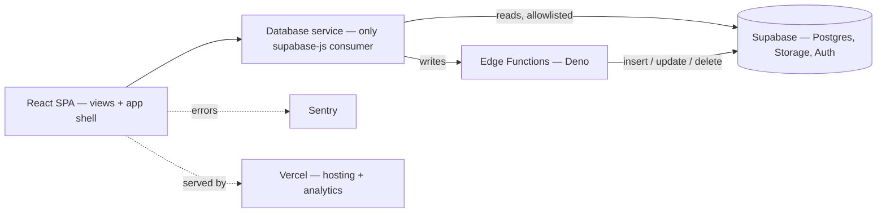

<p align="center">
  
</p>

<h1 align="center">SRM Tools</h1>

<p align="center">
  <b>Internal operations platform for a ready-mix concrete company.</b>
</p>
<p align="center">
  Fleet, people, and plant performance for <a href="https://smyrnatools.com">smyrnatools.com</a><br />
  — tracked across every region and plant.
</p>

<p align="center">
  
  
  
  
  
  
  
</p>

<br />

- **Fleet & assets** — mixers, tractors, trailers, equipment, and pickup trucks, each with verification status, service tracking, and a full change-history timeline.
- **People & personnel** — the operator lifecycle from onboarding through training, active duty, light duty, and separation, plus manager profiles and role-based access.
- **Productivity & reporting** — plant efficiency scoring, live dashboards, and weekly role-based reports rolled up across regions and plants, with charts, maps, and Excel/PDF export.

## Stack

| Layer | Choice |
|-------|--------|
| Framework | React 19 + React Router 7 |
| Build | Vite 6 (output `build/`) |
| Styling | Tailwind CSS 3 — dark / light / gray themes, no plain CSS |
| Backend | Supabase — Postgres, Auth, Storage, Edge Functions (Deno) |
| Charts / maps | Recharts · Leaflet |
| Export | ExcelJS · jsPDF |
| Monitoring | Sentry · Vercel Analytics + Speed Insights |
| Hosting | Vercel |
| Tooling | Vitest + Testing Library · ESLint (flat) · Prettier |

## Getting started

```bash
npm start          # Vite dev server on http://localhost:3000
npm run build      # production build -> build/
npm run preview    # serve the production build
npm test           # vitest run
npm run lint       # eslint src/
npm run format     # prettier --write src
```

A `supabase:*` script family wraps the Supabase CLI (`scripts/supabase.js`) for local dev and edge-function work:

| Script | Purpose |
|--------|---------|
| `supabase:start` · `:stop` · `:status` | Run the local Supabase stack |
| `supabase:db:reset` | Rebuild the local database from migrations |
| `supabase:functions:serve` · `:deploy` · `:invoke` | Develop and ship edge functions |
| `supabase:functions:list` · `:new` · `:download` · `:delete` | Manage edge functions |
| `supabase:login` · `:init` · `:version` | CLI auth and setup |

## Architecture

All database access flows through a single `Database` service (`DatabaseService.js`) — the only approved `@supabase/supabase-js` consumer. The client never mutates the database directly: reads are allowlisted, and every insert/update/delete is performed server-side in a Deno edge function.



## Project structure

```
src/
  app/          shell — components, hooks, context, models, constants, ai, styles
  views/        feature domains — admin, assets, common, people, tools
  services/     PascalCase service classes; DatabaseService.js = only supabase-js consumer
  utils/        pure helpers
  lib/          internal libraries (sunday-analyzer)
  index.jsx     entry — Sentry init, context providers, root <App/>
supabase/
  functions/    Deno edge functions (deployed individually) — all database writes
  migrations/   append-only SQL
scripts/        dev/ops helpers (Supabase CLI wrapper, CalVer)
public/         logos, favicon, PWA manifest + service worker
```

## License

Proprietary — Copyright © 2026 Trenton Taylor. All rights reserved. See [`LICENSE.md`](LICENSE.md).

<p align="center">
  <sub>Built by <strong>Trenton Taylor</strong></sub>
</p>
